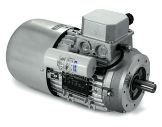

# Proposal

## Table Of Contents
1. [Brake Motor](#brake-motor)
2. [Inverter](#inverter)
3. [DC Injection](#dc-injection)

## Brake Motor
- Can get brake motors which are mechanically sprung brakes that are held off by an electromagnet during operation. Can get them as single phase with capacitors.

- [Carpanelli](https://www.carpanelli.net/eng/catalogo/scheda-mma90la2-378)
- [NeriMotori](https://www.nerimotori.com/en/prodotti/series-of-motors/single-phase-self-braking-motors/single-phase-self-braking-am)

## Inverter
- Single phase or 3 phase inverter.
- Dynamic brake.

## DC Injection
- Can do this single or 3 phase. Crompton Controls are market leaders.
- [Crompton S10 single phase brake](https://cromptoncontrols.co.uk/online-store/#!/products/s10-brake-1-0x2e-5kw-10-12a-230v-direct-on-line-0x3a--dpm1cls---crompton-controls) MEGA FUCKING EXPENNY THOUGH